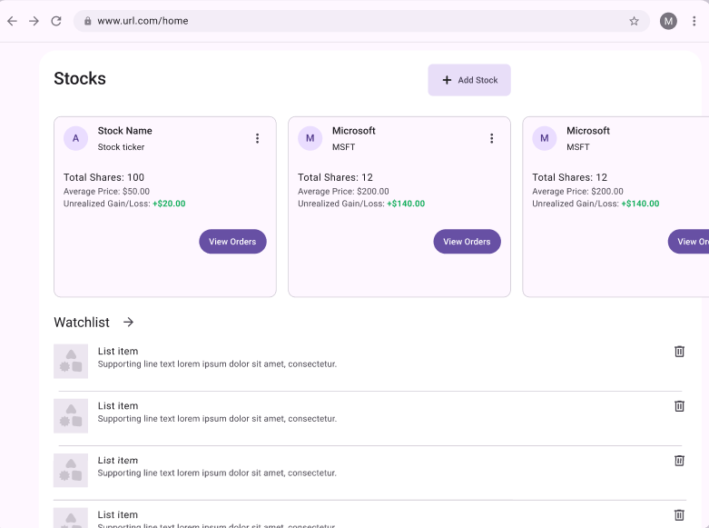
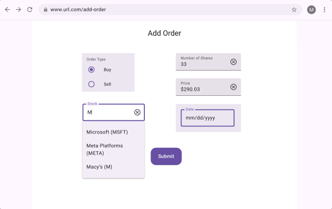
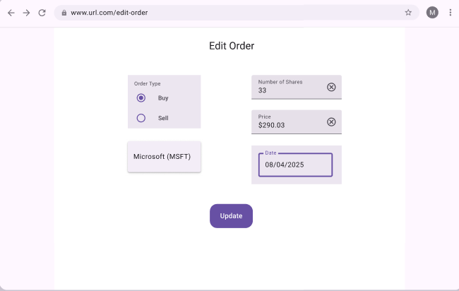
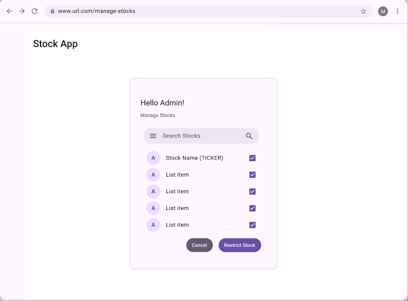
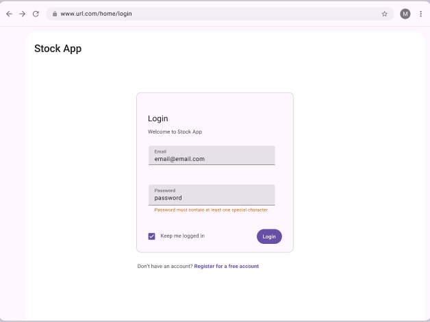
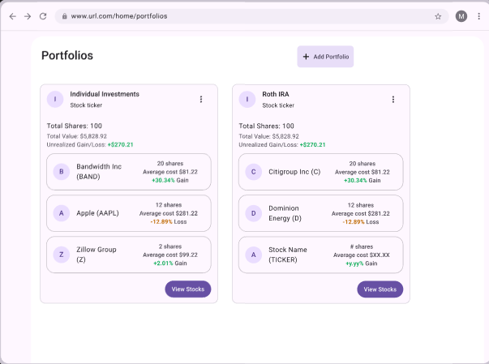
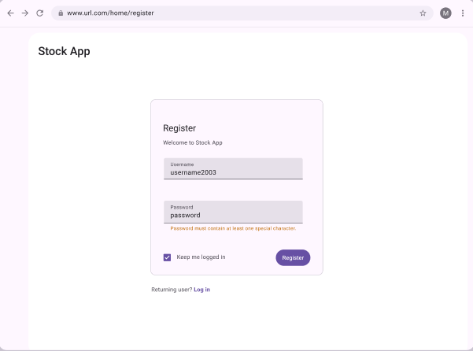
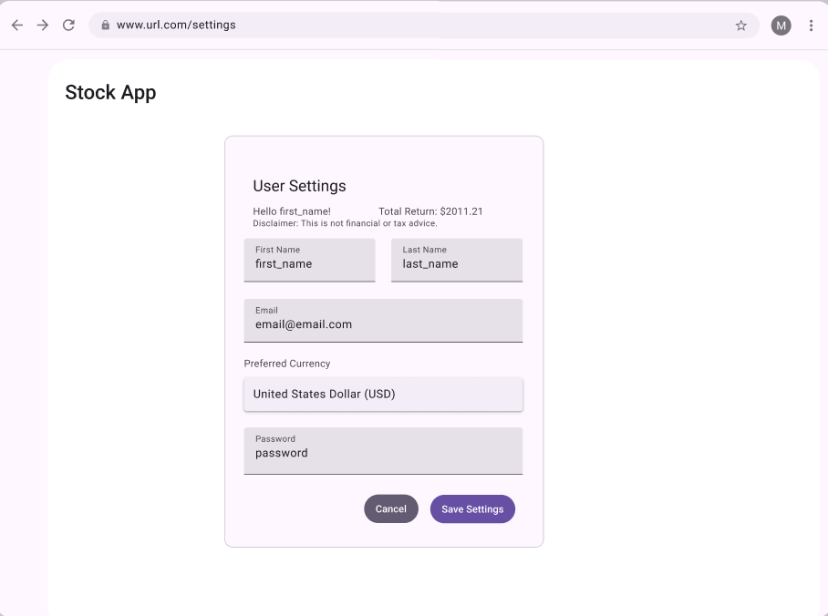

# Stock App Plan (Detailed)

## High-level Requirements

User is a stock holder.

- Creates an account (login/username + password).
- Buy/Add a stock to portfolio.
- Sell/Delete a stock from portfolio.
- View all stocks in portfolio.
- View a graph of a chosen stocks historical price.


Admin

- Delete a user
- Disable/delete a stock from being bought/sold.
- Admins can recommend stocks to users (watchlist, maybe tailored to users).

## User

### Data
- **Username**: name that identifies the user
- **password_hashed**: user special password for logging in
- **currency_type_id**: users preferred currency.
- **first_name**: users first name
- **last_name**: users last name
- **permission**: admin/user (defaults to user)

### Validation
- **Username**: required, unique username
- **password_hashed**: required, cannot be null or blank, must be atleast 8 chars
- **currency_type_id**: required
- **first_name**: not blank
- **last_name**: not blank
- **permission**: enum/boolean to signify admin or user 

## Stocks

### Data

- **Name**: the name of the stock 
- **Ticker**: the unique identifier/abbreviation of the stock name 
- **Asset Type**: enum for the type of asset (stock, bond, ETF) 
- **Industry**: the industry the company is in 
- **Country**: the country that the company is in

Asset Type must be a Java enum.

### Validation

- **Name**: required
- **Ticker**: required, unique
- **Asset Type**: required
- **Industry**: optional
- **Country**: required


## Orders

### Data
- **Transaction Type**: buy/sell (Enum or Boolean), 
- **Stock**: reference to a Stock object, 
- **Shares**: # shares, 
- **Date**: the date the order was executed, 
- **Price**: the price that the order was executed at, 
- **Owner**: reference to the person that did the order

### Validation
- **Transaction Type**: required
- **Stock**: required references stock ticker or stock id
- **Shares**: required, greater than 0
- **Date**: required, cannot be in the future
- **Price**: required, greater than 0
- **Owner**: required, references user id 

## Countries

### Data
- **Country name**: the country name
- **Country code**: short country code (~2-3 letters)
- **country currency**: the primary currency of the country

### Validation
- **Country name**: required, not blank
- **Country code**: unique
- **country currency**: references currency id

## Currencies

### Data
- **currency name**: the currency name
- **currency code**: the FX currency code
- **value/usd**: value of currency to the us dollar

### Validation
- **currency name**: required, not null
- **currency code**: unique
- **value/usd**: greater than 0

## Stock exchange

### Data
- **Exchange name**: the exchanges name
- **exchange code**: the shorthand code for the exchange 
- **TimeZone**: exchange timezone

### Validation
- **Exchange name**: required, not blank
- **exchange code**: unique
- **TimeZone**: required, valid timezone

## Portfolio

### Data
- **user id**: the portfolio users id
- **Stocks**: the stocks in the portfolio
- **Account type**: the account type

### Validation
- **user id**: required, references users id
- **Stocks**: 
- **Account type**: required,  account type enum


## Technical Requirements

- Three layer architecture
- Data stored in a SQL databse.
- Repositories should throw a custom exception, never file-specific exceptions.
- Repository and service classes must be fully tested with both negative and positive cases. Do not use your "production" data file to test your repository.
- account type enum with the investment account (retirement, investing).
- Asset Type enum with the type of stock 

## ERD Diagram


## Wireframes
Home



Stock View


Add Order



Edit Order



Admin - Manage Stocks



Admin - Manage Users


Login



Portfolios



Register



User- Register


User - Settings



## Package/Class Overview

```
http
└───|
    |   stock.http                                                  -- stock HTTP requests
    |   user.http                                                   -- user HTTP requests
    |   order.http                                                  -- order HTTP requests
    |   stock-exchange.http                                         -- stock exchange HTTP requests
    |   portfolio.http                                              -- portfolio HTTP requests
sql
└───|
    |   stock-portfolio-schema-prod.sql                             -- production schema
    |   stock-portfolio-schema-test.sql                             -- test schema
src
├───main
│   └───java
│       └───learn
│           └───stock-portfolio
│               │   App.java                                        -- app entry point
│               │
│               ├───controller
│               │       ErrorResponse.java                          -- matching error responses to HTTP status codes
│               │       GlobalExceptionHandler.java                 -- exception handler
│               │       StockController.java                        -- stock controller
│               │       UserController.java                         -- user controller
│               │       OrderController.java                        -- order controller
│               │       StockExchangeController.java                -- stock exchange controller
│               │       PortfolioController.java                    -- portfolio controller
|               |       CountryController.java                      -- country controller
|               |       CurrencyController.java                     -- currency controller
|               |
│               ├───data
│               |   └───mappers
│               |       │       StockMapper.java                    -- stock mapper
│               |       │       UserMapper.java                     -- user mapper
│               |       │       OrderMapper.java                    -- order mapper
│               |       │       StockExchangeMapper.java            -- stock exchange mapper
│               |       │       PortfolioMapper.java                -- stock exchange mapper
|               |       |       CurrencyMapper.java                 -- currency mapper
|               |       |       CountryMapper.java                  -- country mapper
│               │       DataException.java                          -- data layer custom exception
│               │       StockJdbcTemplateRepository.java            -- concrete repository
│               │       UserJdbcTemplateRepository.java             -- concrete repository
│               │       OrderJdbcTemplateRepository.java            -- concrete repository
│               │       StockExchangeJdbcTemplateRepository.java    -- concrete repository
│               │       portfolioJdbcTemplateRepository.java        -- concrete repository
|               |       countryJdbcTemplateRepository.java          -- concrete repository
|               |       currencyJdcbTemplateRepository.java         -- concrete repository
|               |       CurrencyRepository.java                     -- concrete repository
|               |       CountryRepository.java                      -- concrete repository
│               │       StockRepository.java                        -- repository interface
│               │       UserRepository.java                         -- repository interface
│               │       OrderRepository.java                        -- repository interface
│               │       StockExchangeRepository.java                -- repository interface
│               │       PortfolioRepository.java                    -- repository interface
│               │
│               ├───domain
│               │       Result.java                                 -- domain result for handling success/failure
│               │       ResultType.java                             -- enum for result type
│               │       StockService.java                           -- stock validation/rules
│               │       UserService.java                            -- user validation/rules
│               │       OrderService.java                           -- order validation/rules
│               │       StockExchangeService.java                   -- stock exchange validation/rules
│               │       PortfolioService.java                       -- portfolio validation/rules
|               |       CurrencyService.java                        -- currency validation/rules
|               |       CountryService.java                         -- country validation/rules
│               │
│               ├───models
│               │       Currency.java                               -- currency model
│               │       Country.java                                -- country model
|               |       TransactionType.java                        -- enum for Transacation
|               |       AssetType.java                              -- enum for Asset
|               |       AccountType.java                            -- enum for Account
│               │       Stock.java                                  -- stock model
│               │       User.java                                   -- user model
│               │       Order.java                                  -- order model
│               │       StockExchange.java                          -- stock exchange model
│               │       Portfolio.java                              -- portfolio model
│             
│
└───test
    └───java
        └───learn
            └───stock-portfolio
                ├───data
                │       StockJdbcTemplateRepositoryTest.java        -- StockJdbcTemplateRepository tests
                │       UserJdbcTemplateRepositoryTest.java         -- UserJdbcTemplateRepository tests
                │       OrderJdbcTemplateRepositoryTest.java        -- OrderJdbcTemplateRepository tests
                │       StockExchangeJdbcTemplateRepositoryTest.java -- StockExchangeJdbcTemplateRepository tests
                │       PortfolioJdbcTemplateRepositoryTest.java    -- PortfolioJdbcTemplateRepository tests
                |       CurrencyJdbcTemplateRepositoryTest.java     -- CurrencyJdbcTemplateRepository tests
                |       CountryJdbcTemplateRepositoryTest.java      -- CountryJdbcTemplateRepository tests
                │       KnownGoodState.java                         -- known good state
                │
                └───domain
                        StockServiceTest.java                       -- StockService tests
                        UserServiceTest.java                        -- UserService tests
                        OrderServiceTest.java                       -- OrderService tests
                        StockExchangeServiceTest.java               -- StockExchangeService tests
                        PortfolioServiceTest.java                   -- PortfolioService tests
                        CountryServiceTest.java                     -- CountryService tests
                        CurrencyServiceTest.java                    -- CurrencyService tests
```

## Class Details

### App
- `public static void main(String[])` -- app entry point

### controller.ErrorResponse
- `private final LocalDateTime timestamp` -- timestamp
- `private String message`  -- message
- `public ErrorResponse()` -- constructor
- `public ErrorResponse(String message)` -- constructor with message
- `public LocalDateTime getTimestamp()` -- getter
- `public String getMessage()` -- getter
- `public static <T> ResponseEntity<Object> build(Result<T> result)` -- build error response

### controller.GlobalExceptionHandler
- ` public ResponseEntity<ErrorResponse> handleException` -- global exception handler
-- handlers for other exception types

### controller.StockController
- `private final StockService` -- stock service
- `public StockController(StockService stockService)` -- constructor
- `public ResponseEntity<List<Stock>> findAll()` -- returns a list of all stocks
- `public ResponseEntity<Stock> findById(@PathVariable int id)` -- fetches a stock by its unique ID
- `public ResponseEntity<Stock> findByTicker(@PathVariable String ticker)` -- fetches a stock by its unique ticker
- `public ResponseEntity<Stock> add(@RequestBody Stock stock)` --adds a new stock to the system
- `public ResponseEntity<Stock> update(@PathVariable int id, @RequestBody Stock stock)` -- updates an existing stock
- `public ResponseEntity<Void> deleteById(@PathVariable int id)` -- deletes a stock by its ID
- `public ResponseEntity<List<Stock>> getStocksByIndustry(@RequestParam String industry)` -- fetches all stocks by a specific industry

### controller.UserController
- `private final UserService` -- user service
- `public UserController(UserService UserService)` -- constructor
- `public ResponseEntity<List<User>> findAll()` -- retrieves a list of all users in the system
- `public ResponseEntity<User> add(@RequestBody User user)` -- creates a new user account
- `public ResponseEntity<User> findById(@PathVariable int id)` -- retrieves user information by ID
- `public ResponseEntity<User> update(@PathVariable int id, @RequestBody User user)` -- updates user details
- `public ResponseEntity<Void> deleteById(@PathVariable int id)` -- deletes a user account

### controller.OrderController
- `private final OrderService` -- order service
- `public OrderController(OrderService orderService)` -- constructor
- `public ResponseEntity<Order> add(@RequestBody Order order)` -- places a new order (buy/sell)
- `public ResponseEntity<Order> findById(@PathVariable int id)` -- retrieves an order by its ID
- `public ResponseEntity<List<Order>> findByUser(@PathVariable int userId)` --fetches all orders placed by a specific user
- `public ResponseEntity<List<Order>> findByStock(@RequestParam int stockId)` -- fetches all orders for a specific stock
- `public ResponseEntity<Order> update(@PathVariable int id, @RequestBody Order order)` -- updates order details
- `public ResponseEntity<Void> deleteById(@PathVariable int id)` -- deletes an order

### controller.StockExchangeController
- `private final StockExchangeService` -- stock exchange service
- `public StockExchangeController(StockExchangeService stockService)` -- constructor
- `public ResponseEntity<List<StockExchange>> findAll()` -- retrieves a list of all stock exchanges
- `public ResponseEntity<StockExchange> findById(@PathVariable int id)` -- retrieves a stock exchange by its ID
- `public ResponseEntity<StockExchange> add(@RequestBody StockExchange stockExchange)` -- adds a new stock exchange
- `public ResponseEntity<StockExchange> update(@PathVariable int id, @RequestBody StockExchange stockExchange)` -- updates an existing stock exchange
- `public ResponseEntity<Void> deleteById(@PathVariable int id)` -- deletes a stock exchange by ID

### controller.PortfolioController
- `private final PortfolioService` -- portfolio service
- `public PortfolioController(PortfolioService portfolioService)` -- constructor
- `public ResponseEntity<Portfolio> findByUserId(@PathVariable int userId)` -- retrieves the portfolio for a specific user
- `public ResponseEntity<Portfolio> addStockToPortfolio(@PathVariable int userId, @RequestBody Stock stock)` -- adds a stock to the user's portfolio
- `public ResponseEntity<Portfolio> deleteStockFromPortfolio(@PathVariable int userId, @PathVariable int stockId)` -- removes a stock from the user's portfolio
- `public ResponseEntity<List<Stock>> findAllStocksInPortfolio(@PathVariable int userId) `-- retrieves all stocks in the user's portfolio
- `public ResponseEntity<Portfolio> updateAccountType(@PathVariable int userId, @RequestParam AccountType accountType)` -- updates the account type of a user's portfolio
- `public ResponseEntity<BigDecimal> getPortfolioValue(@PathVariable int userId, @RequestParam String date)` -- gets the portfolio value on a specific date
- `public ResponseEntity<Void> sellStockFromPortfolio(@PathVariable int userId, @PathVariable int stockId)` -- sells a stock from the portfolio
- `public ResponseEntity<Void> updateCostBasisOnDividend(@PathVariable int userId, @RequestBody BigDecimal dividend)` -- updates the cost basis after receiving a dividend

### controller.CountryController
- `private final CountryService` -- country service
- `public CountryController(CountryService countryService)` -- constructor
- `public ResponseEntity<Country> findAll()` -- retrieves a list of all countries
- `public ResponseEntity<Country> findById(@PathVariable int countryId)` -- retrieves the specified country
- `public ResponseEntiry<Country> add(@RequestBody Country country)` -- adds a new country
- `public ResponseEntity<Country> update(@PathVariable int id, @RequestBody Country country)` -- updates an existing country
- `public ReponseEntity<Country> deleteById(@PathVariable int id)` -- deletes a country by ID

### controller.CurrencyController
- `private final CurrencyService` -- currencyservice
- `public CurrencyController(CurrencyService currencyService)` -- constructor
- `public ResponseEntity<Currency> findAll()` -- retrieves a list of all currecies
- `public ResponseEntity<Currency> findById(@PathVariable int currencyId)` -- retrieves the specified currency
- `public ResponseEntiry<Currency> add(@RequestBody Currency currency)` -- adds a new currency
- `public ResponseEntity<Currency> update(@PathVariable int id, @RequestBody Currency currency)` -- updates an existing currency
- `public ReponseEntity<Currecny> deleteById(@PathVariable int id)` -- deletes a currency by ID


### data.mapper.StockMapper
- `public Stock mapRow(ResultSet rs, int rowNum)` -- maps a database record to a Stock object

### data.mapper.UserMapper
- `public User mapRow(ResultSet rs, int rowNum)` -- maps a database record to a User object

### data.mapper.OrderMapper
- `public Order mapRow(ResultSet rs, int rowNum)` -- maps a database record to a Order object

### data.mapper.StockExchangeMapper
- `public StockExchange mapRow(ResultSet rs, int rowNum)` -- maps a database record to a StockExchange object

### data.mapper.PortfolioMapper
- `public Portfolio mapRow(ResultSet rs, int rowNum)` -- maps a database record to a Portfolio object

### data.mapper.CurrencyMapper
- `public Currency mapRow(ResultSet rs, int rowNum)` -- maps a database record to a Currency object

### data.mapper.CountryMapper
- `public Country mapRow(ResultSet rs, int rowNum)` -- maps a database record to a Country object

### data.DataException

Custom data layer exception.

- `public DataException(String, Throwable)` -- constructor, Throwable arg is the root cause exception

### data.StockRepository
- `List<Stock> findAll()` -- returns a list of all stocks
- `Stock findById(int id)` -- finds a stock by its unique ID
- `Stock findByTicker(String ticker)` -- finds a stock by its unique ticker
- `Stock add(Stock stock)` --adds a new stock to the system
- `boolean update(Stock stock)` -- updates an existing stock
- `boolean deleteById(int id)` -- deletes a stock by its ID
- `List<Stock> getStocksByIndustry(@RequestParam String industry)` -- finds all stocks by a specific industry

### data.StockJdbcTemplateRepository
- `JdbcTemplate jdbcTemplate` -- jdbc template
- `public List<Stock> findAll()` -- returns a list of all stocks
- `public Stock findById(int id)` -- finds a stock by its unique ID
- `public Stock findByTicker(String ticker)` -- finds a stock by its unique ticker
- `public Stock add(Stock stock)` --adds a new stock to the system
- `public boolean update(Stock stock)` -- updates an existing stock
- `public boolean deleteById(int id)` -- deletes a stock by its ID
- `public List<Stock> getStocksByIndustry(@RequestParam String industry)` -- finds all stocks by a specific industry

### data.UserRepository
- `List<User> findAll()` -- retrieves a list of all users in the system
- `User add(User user)` -- creates a new user account
- `User findById(int id)` -- retrieves user information by ID
- `boolean update(User user)` -- updates user details
- `boolean deleteById(int id)` -- deletes a user account

### data.UserJdbcTemplateRepository
- `JdbcTemplate jdbcTemplate` -- jdbc template
- `public List<User> findAll()` -- retrieves a list of all users in the system
- `public User add(User user)` -- creates a new user account
- `public User findById(int id)` -- retrieves user information by ID
- `public boolean update(User user)` -- updates user details
- `public boolean deleteById(int id)` -- deletes a user account

### data.OrderRepository
- `Order add(Order order)` -- places a new order (buy/sell)
- `Order findById(int id)` -- retrieves an order by its ID
- `List<Order> findAll()` -- retrieves a list of all orders
- `List<Order> findByUser(int userId)` -- finds all orders placed by a specific user
- `List<Order> findByStock(int stockId)` -- finds all orders for a specific stock
- `boolean update(Order order)` -- updates order details
- `boolean deleteById(int id)` -- deletes an order

### data.OrderJdbcTemplateRepository
- `JdbcTemplate jdbcTemplate` -- jdbc template
- `public Order add(Order order)` -- places a new order (buy/sell)
- `public Order findById(int id)` -- retrieves an order by its ID
- `public List<Order> findAll()` -- retrieves a list of all orders
- `public List<Order> findByUser(int userId)` -- finds all orders placed by a specific user
- `public List<Order> findByStock(int stockId)` -- finds all orders for a specific stock
- `public boolean update(Order order)` -- updates order details
- `public boolean deleteById(int id)` -- deletes an order

### data.StockExchangeRepository
- `List<StockExchange> findAll()` -- retrieves a list of all stock exchanges
- `StockExchange findById(nt id)` -- retrieves a stock exchange by its ID
- `StockExchange add(StockExchange stockExchange)` -- adds a new stock exchange
- `boolean update(StockExchange stockExchange)` -- updates an existing stock exchange
- `boolean deleteById(int id)` -- deletes a stock exchange by ID

### data.StockExchangeJdbcTemplateRepository
- `JdbcTemplate jdbcTemplate` -- jdbc template
- `public List<StockExchange> findAll()` -- retrieves a list of all stock exchanges
- `public StockExchange findById(nt id)` -- retrieves a stock exchange by its ID
- `public StockExchange add(StockExchange stockExchange)` -- adds a new stock exchange
- `public boolean update(StockExchange stockExchange)` -- updates an existing stock exchange
- `public boolean deleteById(int id)` -- deletes a stock exchange by ID

### data.PortfolioRepository
- `Portfolio findByUserId(int userId)` -- retrieves the portfolio for a specific user
- `Portfolio addStockToPortfolio(int userId, Stock stock)` -- adds a stock to the user's portfolio
- `boolean deleteStockFromPortfolio(int userId, int stockId)` -- removes a stock from the user's portfolio
- `List<Stock> findAllStocksInPortfolio(int userId) `-- retrieves all stocks in the user's portfolio
- `boolean updateAccountType(int userId, AccountType accountType)` -- updates the account type of a user's portfolio
- `BigDecimal getPortfolioValue(int userId, String date)` -- gets the portfolio value on a specific date
- `boolean sellStockFromPortfolio(int userId, int stockId)` -- sells a stock from the portfolio
- `boolean updateCostBasisOnDividend(int userId, BigDecimal dividend)` -- updates the cost basis after receiving a dividend
- `BigDecimal calculateCapitalGainsTax(List<Order> orders)` -- gets the capital gains tax

### data.PortfolioJdbcTemplateRepository
- `JdbcTemplate jdbcTemplate` -- jdbc template
- `public Portfolio findByUserId(int userId)` -- retrieves the portfolio for a specific user
- `public Portfolio addStockToPortfolio(int userId, Stock stock)` -- adds a stock to the user's portfolio
- `public boolean deleteStockFromPortfolio(int userId, int stockId)` -- removes a stock from the user's portfolio
- `public List<Stock> findAllStocksInPortfolio(int userId) `-- retrieves all stocks in the user's portfolio
- `public boolean updateAccountType(int userId, AccountType accountType)` -- updates the account type of a user's portfolio
- `public BigDecimal getPortfolioValue(int userId, String date)` -- gets the portfolio value on a specific date
- `public boolean sellStockFromPortfolio(int userId, int stockId)` -- sells a stock from the portfolio
- `public boolean updateCostBasisOnDividend(int userId, BigDecimal dividend)` -- updates the cost basis after receiving a dividend
- `public BigDecimal calculateCapitalGainsTax(List<Order> orders)` -- gets the capital gains tax

### data.CurrencyRepository
- `List<Currency> findAll()` -- retrieves all existing currencies in db
- `Currency findByCurrencyId(int currencyId)` -- retrieves a specific currency
- `Currency addCurrency(Currency currency)` -- adds a specific currency to the db
- `boolean updateCurrency(Currency currency)` -- updates an existing currency
- `boolean deleteCurrency(int currencyId)` -- deletes an existing currency

### data.CurrencyJdbcTemplateRepository
- `JdbcTemplate jdbcTemplate` -- jdbc template
- `public List<Currency> findAll()` -- retrieves all existing currencies in db
- `public Currency findByCurrencyId(int currencyId)` -- retrieves a specific currency
- `public Currency addCurrency(Currency currency)` -- adds a specific currency to the db
- `public boolean updateCurrency(Currency currency)` -- updates an existing currency
- `public boolean deleteCurrency(int currencyId)` -- deletes an existing currency

### data.CountryRepository
- `List<Country> findAll()` -- retrives all countries in db
- `Country findById(int countryId)` -- retrieves a specific country
- `Country addCountry(Country Country)` -- adds a specific country to the db
- `boolean updateCountry(Country country)` -- updates an existing country
- `boolean deleteCountry(int countryId)` -- deletes an existing country

### data.CountryJdbcRepository
- `JdbcTemplate jdbcTemplate` -- jdbc template
- `public List<Country> findAll()` -- retrives all countries in db
- `public Country findById(int countryId)` -- retrieves a specific country
- `public Country addCountry(Country Country)` -- adds a specific country to the db
- `public boolean updateCountry(Country country)` -- updates an existing country
- `public boolean deleteCountry(int countryId)` -- deletes an existing country

### domain.ResultType

An enum with three values:
SUCCESS,
INVALID,
NOT_FOUND

### domain.Result
- `private final ArrayList<String> messages` -- error messages
- `private ResultType type` -- result type enum
- `private T payload` -- payload
- `public ResultType getType()` -- result type getter
- `public boolean isSuccess()` -- calculated getter, true if no error messages
- `public T getPayload()` -- payload getter
- `public void setPayload(T payload)` -- payload setter
- `public void setType(ResultType type)` -- result type setter
- `public List<String> getMessages()` -- messages getter
- `public void addMessage(String message, ResultType type)` -- adds an error message to messages
- `public void addMessage(String format, ResultType resultType, Object... args)` -- adds an error message to messages

### domain.StockService
- `private StockRepository repository` -- stock repository interface
- `public List<Stock> findAll()` -- returns a list of all stocks
- `public Stock findById(int id)` -- finds a stock by its unique ID
- `public Stock findByTicker(String ticker)` -- finds a stock by its unique ticker
- `public Stock add(Stock stock)` --adds a new stock to the system
- `public Result<Stock> update(Stock stock)` -- updates an existing stock
- `public boolean deleteById(int id)` -- deletes a stock by its ID
- `public List<Stock> getStocksByIndustry(@RequestParam String industry)` -- finds all stocks by a specific industry

### domain.UserService
- `private UserRepository repository` -- user repository interface
- `public List<User> findAll()` -- retrieves a list of all users in the system
- `public User add(User user)` -- creates a new user account
- `public User findById(int id)` -- retrieves user information by ID
- `public Result<User> update(User user)` -- updates user details
- `public boolean deleteById(int id)` -- deletes a user account

### domain.OrderService
- `private OrderRepository repository` -- order repository interface
- `public Order add(Order order)` -- places a new order (buy/sell)
- `public Order findById(int id)` -- retrieves an order by its ID
- `public List<Order> findAll()` -- retrieves a list of all orders
- `public List<Order> findByUser(int userId)` -- finds all orders placed by a specific user
- `public List<Order> findByStock(int stockId)` -- finds all orders for a specific stock
- `public Result<Order> update(Order order)` -- updates order details
- `public boolean deleteById(int id)` -- deletes an order

### domain.StockExchangeService
- `private StockExchangeRepository repository` -- stock exchange repository interface
- `public List<StockExchange> findAll()` -- retrieves a list of all stock exchanges
- `public StockExchange findById(int id)` -- retrieves a stock exchange by its ID
- `public StockExchange add(StockExchange stockExchange)` -- adds a new stock exchange
- `public Result<StockExchange> update(StockExchange stockExchange)` -- updates an existing stock exchange
- `public boolean deleteById(int id)` -- deletes a stock exchange by ID

### domain.PortfolioService
- `private PortfolioRepository repository` -- portfolio repository interface
- `public Portfolio findByUserId(int userId)` -- retrieves the portfolio for a specific user
- `public Portfolio addStockToPortfolio(int userId, Stock stock)` -- adds a stock to the user's portfolio
- `public boolean deleteStockFromPortfolio(int userId, int stockId)` -- removes a stock from the user's portfolio
- `public List<Stock> findAllStocksInPortfolio(int userId) `-- retrieves all stocks in the user's portfolio
- `public Result<Portfolio> updateAccountType(int userId, AccountType accountType)` -- updates the account type of a user's portfolio
- `public BigDecimal getPortfolioValue(int userId, String date)` -- gets the portfolio value on a specific date
- `public boolean sellStockFromPortfolio(int userId, int stockId)` -- sells a stock from the portfolio
- `public Result<Portfolio> updateCostBasisOnDividend(int userId, BigDecimal dividend)` -- updates the cost basis after receiving a dividend
- `public BigDecimal calculateCapitalGainsTax(List<Order> orders)` -- gets the capital gains tax

### domain.CountryService
- `private CountryRepository repository` -- country repository interface
- `public List<Country> findAll()` -- retrieves all listed countries
- `public Country findById(int countryId)` --  retrieves specific country by id
- `public Country add(Country country)` -- adds a specific country
- `public Result<Country> update(Country country)` -- updates an existing country
- `public boolean deleteById(int countryId)` -- deletes a country by ID

### domain.CurrencyService
- `private CurrencyRepository repository` -- currency repository interface
- `public List<Curency> findAll()` -- retrieves all listed currencies
- `public Currency findById(int currencyId)` -- retrieves a specific currency
- `public Currency add(Currency currency)` -- adds a specific currency
- `public Result<Currency> update(Currency currency)` -- updates an existing currency
- `public boolean deleteById(int currencyId)` -- deletes a currency by ID

### models.AssetType
enum with values:
Stock,
Bond,
ETF

### models.AccountType

An enum with two values:
retirement, 
investing 

### models.TransactionType

An enum with two values:
buy,
sell

### models.Currency
- `private int id`
- `private String name`
- `private String code`
- `private BigDecimal valueToUsd`

### models.Country
- `private int id`
- `private Currency currency`
- `private String name`
- `private String code`


### models.StockExchange
- `private int id`
- `public String name`
- `public String code`
- `public BigDecimal exchangeRate`


### models.User
- `private int id`
- `private String userName`
- `private String hashedWord`
- `public String currencyType`
- `public String firstName`
- `public String lastName`
- `private boolean isAdmin`
- `private int portfolioId`

### models.Order
- `private int id`
- `private Transaction transactionType`
- `private int stockId`
- `private BigDecimal numShares`
- `private LocalDateTime date`
- `private BigDecimal price`
- `private int userId`

### models.Stock
- `private int id`
- `private String name`
- `private String ticker`
- `private AssetType assetType`
- `private String industry`
- `private Country country`

### models.Portfolio
- `private int id`
- `private int userId`
- `private List<Stocks> stocks`
- `private AccountType accountType`

## Steps
1. Create the Production Database: Create tables for Currency, Portfolio, User, UserPortfolio, Countries, Stocks, Orders, and PortfolioOrder. Add data if needed.
2. Create the Test Database: Create a transaction script for testing for the tables (Currency, Portfolio, User, UserPortfolio, Countries, Stocks, Orders, and PortfolioOrder). Create the tables and add test data for each table in the transaction script.
3. Set Up Maven Project: Create a Maven project and add dependencies for JUnit, Spring Boot, and MYSQL.
4. Create Model Classes: Create the User, Stock, Order, Currency, Country, Portfolio, StockExchange, AssetType, AccountType, and TransactionType models.
5. Create Mappers: Create data mappers for Stock, User, Order, StockExchange, and Portfolio.
6. Create Repository Layer Classes and Tests: Create the DataException class. Create the Repository interface, JdbcTemplateRepository class, and JdbcTemplateRepositoryTest test class for Stock, User, Order, StockExchange, and Portfolio.
7. Create Service Layer: Create the Service class and ServiceTest test class for Stock, User, Order, StockExchange, and Portfolio.
8. Create Controller Layer: Create the Controller class and HTTP requests for Stock, User, Order, StockExchange, and Portfolio. Remember to use OpenAPI/Swagger documentation.
9. Create the App class, add database configuration secrets in application.properties, and run the application.