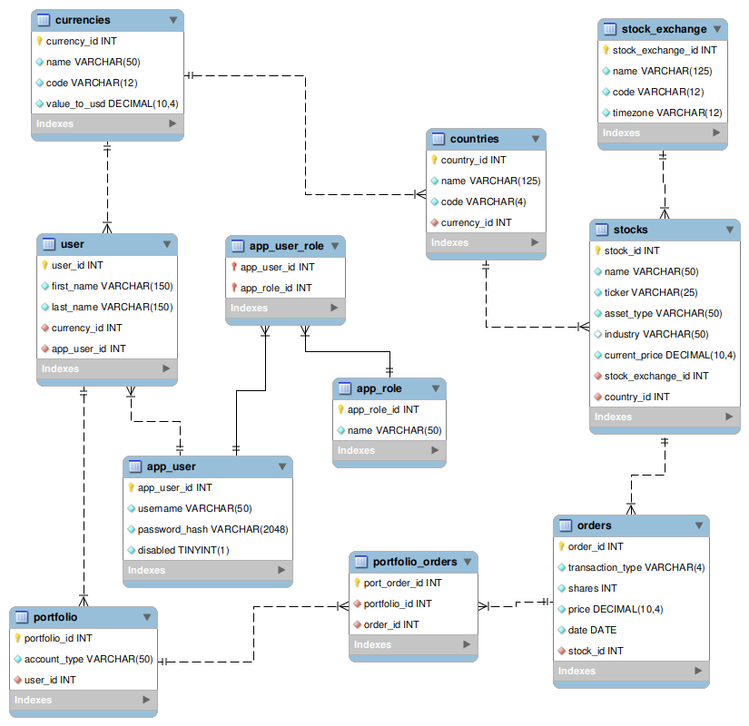

# Stock App Plan (Detailed)

## High-level Requirements

User is a stock holder.

- Creates an account (login/username + password).
- Buy/Add a stock to portfolio.
- Sell/Delete a stock from portfolio.
- View all stocks in portfolio.
- View a graph of a chosen stocks historical price.


Admin

- Delete a user
- Disable/delete a stock from being bought/sold.
- Admins can recommend stocks to users (watchlist, maybe tailored to users).

## User

### Data
- **Username**: name that identifies the user
- **password_hashed**: user special password for logging in
- **currency_type_id**: users preferred currency.
- **first_name**: users first name
- **last_name**: users last name
- **permission**: admin/user (defaults to user)

### Validation
- **Username**: required, unique username
- **password_hashed**: required, cannot be null or blank, must be atleast 8 chars
- **currency_type_id**: required
- **first_name**: not blank
- **last_name**: not blank
- **permission**: enum/boolean to signify admin or user 

## Stocks

### Data

- **Name**: the name of the stock 
- **Ticker**: the unique identifier/abbreviation of the stock name 
- **Asset Type**: enum for the type of asset (stock, bond, ETF) 
- **Industry**: the industry the company is in 
- **Country**: the country that the company is in

Asset Type must be a Java enum.

### Validation

- **Name**: required
- **Ticker**: required, unique
- **Asset Type**: required
- **Industry**: optional
- **Country**: required


## Orders

### Data
- **Transaction Type**: buy/sell (Enum or Boolean), 
- **Stock**: reference to a Stock object, 
- **Shares**: # shares, 
- **Date**: the date the order was executed, 
- **Price**: the price that the order was executed at, 
- **Owner**: reference to the person that did the order

### Validation
- **Transaction Type**: required
- **Stock**: required references stock ticker or stock id
- **Shares**: required, greater than 0
- **Date**: required, cannot be in the future
- **Price**: required, greater than 0
- **Owner**: required, references user id 

## Countries

### Data
- **Country name**: the country name
- **Country code**: short country code (~2-3 letters)
- **country currency**: the primary currency of the country

### Validation
- **Country name**: required, not blank
- **Country code**: unique
- **country currency**: references currency id

## Currencies

### Data
- **currency name**: the currency name
- **currency code**: the FX currency code
- **value/usd**: value of currency to the us dollar

### Validation
- **currency name**: required, not null
- **currency code**: unique
- **value/usd**: greater than 0

## Stock exchange

### Data
- **Exchange name**: the exchanges name
- **exchange code**: the shorthand code for the exchange 
- **TimeZone**: exchange timezone

### Validation
- **Exchange name**: required, not blank
- **exchange code**: unique
- **TimeZone**: required, valid timezone

## Portfolio

### Data
- **user id**: the portfolio users id
- **Stocks**: the stocks in the portfolio
- **Account type**: the account type

### Validation
- **user id**: required, references users id
- **Stocks**: 
- **Account type**: required,  account type enum


## Technical Requirements

- Three layer architecture
- Data stored in a SQL databse.
- Repositories should throw a custom exception, never file-specific exceptions.
- Repository and service classes must be fully tested with both negative and positive cases. Do not use your "production" data file to test your repository.
- account type enum with the investment account (retirement, investing).
- Asset Type enum with the type of stock 
- Country enum with country names and codes
- Currency enum with currency signs and names

## ERD Diagram


## Wireframes

## Package/Class Overview

```
src
├───main
│   └───java
│       └───learn
│           └───stock-portfolio
│               │   App.java                                         -- app entry point
│               │
│               ├───controller
│               │       ErrorResponse.java                          -- matching error responses to HTTP status codes
│               │       GlobalExceptionHandler.java                 -- exception handler
│               │       StockController.java                        -- stock controller
│               │       UserController.java                         -- user controller
│               │       OrderController.java                        -- order controller
│               │       StockExchangeController.java                -- stock exchange controller
│               │       PortfolioController.java                    -- portfolio controller
|               |
│               ├───data
│               |   └───mappers
│               |       │       StockMapper.java                    -- stock mapper
│               |       │       UserMapper.java                     -- user mapper
│               |       │       OrderMapper.java                    -- order mapper
│               |       │       StockExchangeMapper.java            -- stock exchange mapper
│               |       │       PortfolioMapper.java                -- stock exchange mapper
│               │       DataException.java                          -- data layer custom exception
│               │       StockJdbcTemplateRepository.java            -- concrete repository
│               │       UserJdbcTemplateRepository.java             -- concrete repository
│               │       OrderJdbcTemplateRepository.java            -- concrete repository
│               │       StockExchangeJdbcTemplateRepository.java    -- concrete repository
│               │       portfolioJdbcTemplateRepository.java        -- concrete repository
│               │       StockRepository.java                        -- repository interface
│               │       UserRepository.java                         -- repository interface
│               │       OrderRepository.java                        -- repository interface
│               │       StockExchangeRepository.java                -- repository interface
│               │       PortfolioRepository.java                    -- repository interface
│               │
│               ├───domain
│               │       Result.java                                 -- domain result for handling success/failure
│               │       ResultType.java                             -- enum for result type
│               │       StockService.java                           -- stock validation/rules
│               │       UserService.java                            -- user validation/rules
│               │       OrderService.java                           -- order validation/rules
│               │       StockExchangeService.java                   -- stock exchange validation/rules
│               │       PortfolioService.java                       -- portfolio validation/rules
│               │
│               ├───models
│               │       Currency.java                               -- enum representing currencies
│               │       Country.java                                -- enum representing countries
|               |       TransactionType.java                        -- enum for Transacation
|               |       AssetType.java                              -- enum for Asset
|               |       AccountType.java                            -- enum for Account
│               │       Stock.java                                  -- stock model
│               │       User.java                                   -- user model
│               │       Order.java                                  -- order model
│               │       StockExchange.java                          -- stock exchange model
│               │       Portfolio.java                              -- portfolio model
│               │
│
└───test
    └───java
        └───learn
            └───solar
                ├───data
                │       StockJdbcTemplateRepositoryTest.java        -- StockJdbcTemplateRepository tests
                │       UserJdbcTemplateRepositoryTest.java         -- UserJdbcTemplateRepository tests
                │       OrderJdbcTemplateRepositoryTest.java        -- OrderJdbcTemplateRepository tests
                │       StockExchangeJdbcTemplateRepositoryTest.java -- StockExchangeJdbcTemplateRepository tests
                │       PortfolioJdbcTemplateRepositoryTest.java    -- PortfolioJdbcTemplateRepository tests
                │       KnownGoodState.java                         -- known good state
                │
                └───domain
                        StockServiceTest.java                       -- StockService tests
                        UserServiceTest.java                        -- UserService tests
                        OrderServiceTest.java                       -- OrderService tests
                        StockExchangeServiceTest.java               -- StockExchangeService tests
                        PortfolioServiceTest.java                   -- PortfolioService tests
```

## Class Details

### App
- `public static void main(String[])` -- app entry point

### controller.ErrorResponse
- `private final LocalDateTime timestamp` -- timestamp
- `private String message`  -- message
- `public ErrorResponse()` -- constructor
- `public ErrorResponse(String message)` -- constructor with message
- `public LocalDateTime getTimestamp()` -- getter
- `public String getMessage()` -- getter
- `public static <T> ResponseEntity<Object> build(Result<T> result)` -- build error response

### controller.GlobalExceptionHandler
- ` public ResponseEntity<ErrorResponse> handleException` -- global exception handler
-- handlers for other exception types

### controller.StockController
- `private final StockService` -- stock service
- `public StockController(StockService stockService)` -- constructor
- `public ResponseEntity<List<Stock>> findAll()` -- returns a list of all stocks
- `public ResponseEntity<Stock> findById(@PathVariable int id)` -- fetches a stock by its unique ID
- `public ResponseEntity<Stock> findByTicker(@PathVariable String ticker)` -- fetches a stock by its unique ticker
- `public ResponseEntity<Stock> add(@RequestBody Stock stock)` --adds a new stock to the system
- `public ResponseEntity<Stock> update(@PathVariable int id, @RequestBody Stock stock)` -- updates an existing stock
- `public ResponseEntity<Void> deleteById(@PathVariable int id)` -- deletes a stock by its ID
- `public ResponseEntity<List<Stock>> getStocksByIndustry(@RequestParam String industry)` -- fetches all stocks by a specific industry

### controller.UserController
- `private final UserService` -- user service
- `public UserController(UserService UserService)` -- constructor
- `public ResponseEntity<List<User>> findAll()` -- retrieves a list of all users in the system
- `public ResponseEntity<User> add(@RequestBody User user)` -- creates a new user account
- `public ResponseEntity<User> findById(@PathVariable int id)` -- retrieves user information by ID
- `public ResponseEntity<User> update(@PathVariable int id, @RequestBody User user)` -- updates user details
- `public ResponseEntity<Void> deleteById(@PathVariable int id)` -- deletes a user account

### controller.OrderController
- `private final OrderService` -- order service
- `public OrderController(OrderService orderService)` -- constructor
- `public ResponseEntity<Order> add(@RequestBody Order order)` -- places a new order (buy/sell)
- `public ResponseEntity<Order> findById(@PathVariable int id)` -- retrieves an order by its ID
- `public ResponseEntity<List<Order>> findByUser(@PathVariable int userId)` --fetches all orders placed by a specific user
- `public ResponseEntity<List<Order>> findByStock(@RequestParam int stockId)` -- fetches all orders for a specific stock
- `public ResponseEntity<Order> update(@PathVariable int id, @RequestBody Order order)` -- updates order details
- `public ResponseEntity<Void> deleteById(@PathVariable int id)` -- deletes an order

### controller.StockExchangeController
- `private final StockExchangeService` -- stock exchange service
- `public StockExchangeController(StockExchangeService stockService)` -- constructor
- `public ResponseEntity<List<StockExchange>> findAll()` -- retrieves a list of all stock exchanges
- `public ResponseEntity<StockExchange> findById(@PathVariable int id)` -- retrieves a stock exchange by its ID
- `public ResponseEntity<StockExchange> add(@RequestBody StockExchange stockExchange)` -- adds a new stock exchange
- `public ResponseEntity<StockExchange> update(@PathVariable int id, @RequestBody StockExchange stockExchange)` -- updates an existing stock exchange
- `public ResponseEntity<Void> deleteById(@PathVariable int id)` -- deletes a stock exchange by ID

### controller.PortfolioController
- `private final PortfolioService` -- portfolio service
- `public PortfolioController(PortfolioService portfolioService)` -- constructor
- `public ResponseEntity<Portfolio> findByUserId(@PathVariable int userId)` -- retrieves the portfolio for a specific user
- `public ResponseEntity<Portfolio> addStockToPortfolio(@PathVariable int userId, @RequestBody Stock stock)` -- adds a stock to the user's portfolio
- `public ResponseEntity<Portfolio> deleteStockFromPortfolio(@PathVariable int userId, @PathVariable int stockId)` -- removes a stock from the user's portfolio
- `public ResponseEntity<List<Stock>> findAllStocksInPortfolio(@PathVariable int userId) `-- retrieves all stocks in the user's portfolio
- `public ResponseEntity<Portfolio> updateAccountType(@PathVariable int userId, @RequestParam AccountType accountType)` -- updates the account type of a user's portfolio
- `public ResponseEntity<BigDecimal> getPortfolioValue(@PathVariable int userId, @RequestParam String date)` -- gets the portfolio value on a specific date
- `public ResponseEntity<Void> sellStockFromPortfolio(@PathVariable int userId, @PathVariable int stockId)` -- sells a stock from the portfolio
- `public ResponseEntity<Void> updateCostBasisOnDividend(@PathVariable int userId, @RequestBody BigDecimal dividend)` -- updates the cost basis after receiving a dividend

### data.mapper.StockMapper
- `public Stock mapRow(ResultSet rs, int rowNum)` -- maps a database record to a Stock object

### data.mapper.UserMapper
- `public User mapRow(ResultSet rs, int rowNum)` -- maps a database record to a User object

### data.mapper.OrderMapper
- `public Order mapRow(ResultSet rs, int rowNum)` -- maps a database record to a Order object

### data.mapper.StockExchangeMapper
- `public StockExchange mapRow(ResultSet rs, int rowNum)` -- maps a database record to a StockExchange object

### data.mapper.PortfolioMapper
- `public Portfolio mapRow(ResultSet rs, int rowNum)` -- maps a database record to a Portfolio object

### data.DataException

Custom data layer exception.

- `public DataException(String, Throwable)` -- constructor, Throwable arg is the root cause exception

### data.StockRepository

### data.StockJdbcTemplateRepository

### data.UserRepository

### data.UserJdbcTemplateRepository

### data.OrderRepository

### data.OrderJdbcTemplateRepository

### data.StockExchangeRepository

### data.StockExchangeJdbcTemplateRepository

### data.PortfolioRepository

### data.PortfolioJdbcTemplateRepository

### domain.ResultType

An enum with three values:
SUCCESS,
INVALID,
NOT_FOUND

### domain.Result
- `private final ArrayList<String> messages` -- error messages
- `private ResultType type` -- result type enum
- `private T payload` -- payload
- `public ResultType getType()` -- result type getter
- `public boolean isSuccess()` -- calculated getter, true if no error messages
- `public T getPayload()` -- payload getter
- `public void setPayload(T payload)` -- payload setter
- `public void setType(ResultType type)` -- result type setter
- `public List<String> getMessages()` -- messages getter
- `public void addMessage(String message, ResultType type)` -- adds an error message to messages
- `public void addMessage(String format, ResultType resultType, Object... args)` -- adds an error message to messages

### domain.StockService
- `private StockRepository repository` -- stock repository interface
- `public List<Stock> findAll()` -- returns a list of all stocks
- `public Stock findById(int id)` -- finds a stock by its unique ID
- `public Stock findByTicker(String ticker)` -- finds a stock by its unique ticker
- `public Stock add(Stock stock)` --adds a new stock to the system
- `public Result<Stock> update(Stock stock)` -- updates an existing stock
- `public boolean deleteById(int id)` -- deletes a stock by its ID
- `public List<Stock> getStocksByIndustry(@RequestParam String industry)` -- finds all stocks by a specific industry

### domain.UserService
- `private UserRepository repository` -- user repository interface
- `public List<User> findAll()` -- retrieves a list of all users in the system
- `public User add(User user)` -- creates a new user account
- `public User findById(int id)` -- retrieves user information by ID
- `public Result<User> update(User user)` -- updates user details
- `public boolean deleteById(int id)` -- deletes a user account

### domain.OrderService
- `private OrderRepository repository` -- order repository interface
- `public Order add(Order order)` -- places a new order (buy/sell)
- `public Order findById(int id)` -- retrieves an order by its ID
- `public List<Order> findAll()` -- retrieves a list of all orders
- `public List<Order> findByUser(int userId)` -- finds all orders placed by a specific user
- `public List<Order> findByStock(int stockId)` -- finds all orders for a specific stock
- `public Result<Order> update(Order order)` -- updates order details
- `public boolean deleteById(int id)` -- deletes an order

### domain.StockExchangeService
- `private StockExchangeRepository repository` -- stock exchange repository interface
- `public List<StockExchange> findAll()` -- retrieves a list of all stock exchanges
- `public StockExchange findById(nt id)` -- retrieves a stock exchange by its ID
- `public StockExchange add(StockExchange stockExchange)` -- adds a new stock exchange
- `public Result<StockExchange> update(StockExchange stockExchange)` -- updates an existing stock exchange
- `public boolean deleteById(int id)` -- deletes a stock exchange by ID

### domain.PortfolioService
- `private PortfolioRepository repository` -- portfolio repository interface
- `public BigDecimal calculateCapitalGainsTax(List<Order> orders)` -- gets the capital gains tax

### models.AssetType
enum with values:
Stock,
Bond,
ETF

### models.AccountType

An enum with two values:
retirement, 
investing 

### models.TransactionType

An enum with two values:
buy,
sell

### models.Currency

An enum with values:
USD,
EUR,
GBP,
CNY,
JPY,
MXN,
INR,
(and more)

### models.Country

An enum with values for countries of the world:


### models.StockExchange
- `private int id`
- `public String name`
- `public String code`
- `public BigDecimal exchangeRate`


### models.User
- `private int id`
- `private String userName`
- `private String hashedWord`
- `public String currencyType`
- `public String firstName`
- `public String lastName`
- `private boolean isAdmin`
- `private int portfolioId`

### models.Order
- `private int id`
- `private Transaction transactionType`
- `private int stockId`
- `private BigDecimal numShares`
- `private LocalDateTime date`
- `private BigDecimal price`
- `private int userId`

### models.Stock
- `private int id`
- `private String name`
- `private String ticker`
- `private AssetType assetType`
- `private String industry`
- `private Country country`

### models.Portfolio
- `private int id`
- `private int userId`
- `private List<Stocks> stocks`
- `private AccountType accountType`

## Steps
1. Set Up Maven Project: Initialize the project with Maven and add dependencies for JUnit 5, Spring Boot, and MySQL Database.
2. Create Model Classes: Implement classes/enums for User, Stock, Order, Currency, Country, Portfolio, etc.
3. Create Repository Layer: Implement repositories using JdbcTemplate to interact with the database. Ensure custom exceptions (like DataException) are used.
4. Service Layer: Implement the business logic, ensuring proper validation and interactions between the models.
5. Controller Layer: Implement controllers to handle HTTP requests and route them to the appropriate services (OpenAPI/Swagger).
6. Testing: Implement tests for all repository and service classes. Create mock data and ensure that tests cover all

1. Create a Maven project.
2. Add jUnit 5, Jupiter, as a Maven dependency and refresh Maven
3. Create packages.
4. Create the `Panel` model.
5. Create the `Material` enum.
6. Create the data layer's custom `DataException`
7. Create the `PanelFileRepository` class.

    All methods should catch IOExceptions and throw `DataException`.

    - add the filePath field and create a constructor to initialize the field
    - generate tests for `PanelFileRepository`, should be located in `src/test/java/learn/solar/data/PanelFileRepositoryTest`
    - create a `data` directory in the project root. add test, seed, and production data files
    - implement `findAll`, `serialize`, and `deserialize`. these are all private method. may be useful to make `findAll` public temporarily and test it quick.
    - implement `findBySection`, it uses `findAll`. test it naively (no known-good-state for now)
    - implement `add`
    - improve tests by establishing known-good-state with `@BeforeAll`
    - test `add`
    - implement `update`
    - test `update`
    - implement `deleteById`
    - test `deleteById`

8. Extract the `PanelRepository` interface (IntelliJ: Refactor -> Extract Interface) from `PanelFileRepository`.
9. Create `PanelResult`.
10. Create `PanelService`.

    - add a `PanelRepository` (interface) field with a corresponding constructor
    - generate tests for `PanelService`
    - create `PanelRepositoryTestDouble` to support service testing, this test class implements `PanelRepository`
    - implement `findBySection` and test, implement just enough code in `PanelRepositoryTestDouble` to enable service testing
    - implement `add` and test, requires validation
    - implement `update` and test, requires validation
    - implement `deleteById` and test

11. Create `View`

    - add `Scanner` field
    - create read* methods: `readString`, `readRequiredString`, `readInt`, `readInt` (with min/max)

12. Create `Controller`

    - add fields for service and view with corresponding constructor
    - add a `run` method

13. Create `App` and the `main` method.

    - instantiate all required objects: repository, service, view, and controller
    - run the controller

14. Work back and forth between controller and view.

    Run early and often. Add `System.out.println`s as breadcrumbs in controller, but don't forget to remove them when development is complete.

    Determine the correct sequence for service calls and view calls. What is the order?

    - implement `chooseOptionFromMenu` and `printHeader` in view
    - use them in the controller's `run`
    - implement `viewBySection` in controller, complete required view methods: `readSection`, `printPanels`
    - implement `addPanel` in controller, complete required view methods: `makePanel`, `readMaterial`, `printResult`
    - implement `updatePanel` in controller, complete required view methods: `choosePanel`, `update`
    - implement `deletePanel` in controller, complete required view methods (`deletePanel` can re-use `choosePanel`)

## Controller Perspectives

### View Panels by Section
1. collect section name from the view
2. use the name to fetch panels from the service
3. use the view to display panels

### Add a Panel
1. collect a complete and new panel from the view
2. use the service to add the panel and grab its result
3. display the result in the view

### Update a Panel
1. collect section name from the view
2. use the name to fetch panels from the service
3. display the panels in the view and allow the user to choose a panel (if no panel selected, abort)
4. update panel properties (setters) in the view
5. use the service to update/save the panel and grab its result
6. display the result in the view

### Delete a Panel
1. collect section name from the view
2. use the name to fetch panels from the service
3. display the panels in the view and allow the user to choose a panel (if no panel selected, abort)
4. use the service to delete the panel by its identifier
5. display success or failure in the view